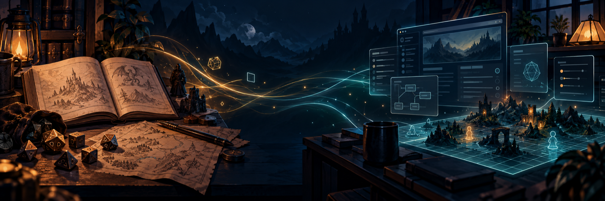

  

<h1 align="center">Hola, soy Manu Romera 👋</h1>

  <strong>Convierto juegos de rol en experiencias digitales que se sienten vivas.</strong> 
  Diseño sistemas, módulos, automatizaciones y traducciones para Foundry VTT.

  
  
  
  

---

### Código para contar mejores historias

Mi trabajo vive en el punto donde se encuentran el **desarrollo**, el **diseño de juego** y la **narrativa**. Me gusta coger una idea nacida alrededor de una mesa y convertirla en una herramienta cuidada: hojas que ayudan en vez de estorbar, automatizaciones con intención y mundos digitales que conservan la personalidad del juego original.

- 🎲 Sistemas completos para Foundry VTT
- ⚙️ Módulos, automatizaciones y utilidades para mesa
- 🌍 Traducción y localización al español
- ♿ Accesibilidad y experiencias de juego más inclusivas
- ✍️ Aventuras y juegos propios

### Proyectos destacados

| Proyecto | Qué aporta |
| :--- | :--- |
| **[RUIDO BLANCO](https://github.com/ManuRomera/ruido-blanco)** | Juego de rol de investigación contemporánea emergente, con sistema para Foundry VTT y reglamento completo. |
| **[Entre Ruinas](https://github.com/ManuRomera/mr-entre-ruinas)** | Sistema para Foundry VTT 13–14 del juego narrativo de MIDRA, con *Un Mundo Violento* y *Refugios*. |
| **[Cuervos de Asgard MC](https://github.com/ManuRomera/cuervos-de-asgard-mc)** | Sistema no oficial con hojas, automatizaciones, motos, comunidad, dones, generadores y compendios. |
| **[Brindlewood Bay](https://github.com/ManuRomera/brindlewood-bay-foundry)** | Misterios, té y las Expertas del Crimen: adaptación en español para Foundry VTT 13. |
| **[YSYSTEM3 SRD](https://github.com/ManuRomera/ysystem3-srd)** | Hojas de PJ/PNJ, tiradas, combate, salud, proezas, compendios y variantes visuales. |
| **[Daggerheart en español](https://github.com/ManuRomera/translation-spanish-daggerheart)** | Traducción completa de la interfaz de Daggerheart para Foundry VTT 13. |

### También estoy construyendo

**Herramientas para la mesa** — [Mausritter Damage Helper](https://github.com/ManuRomera/mausritter-damage-helper), [PBPE Exportador](https://github.com/ManuRomera/pbpe-exportador) y [Standee Portrait](https://github.com/ManuRomera/standee-portrait).

**Mundos y aventuras** — [Eterno Azul](https://github.com/ManuRomera/eterno-azul-foundry), [Sensa Fine](https://github.com/ManuRomera/Sensa_Fine), [Los Abuelos de la Justicia](https://github.com/ManuRomera/los-abuelos-de-la-justicia) y [Frontier Scum ES](https://github.com/ManuRomera/FrontierScum-ES-).

### Mi brújula

> La tecnología funciona mejor cuando desaparece detrás de la historia.

Construyo con una idea sencilla: que directores y jugadores dediquen menos tiempo a pelearse con la herramienta y más tiempo a crear recuerdos en la mesa. Si te interesan los juegos de rol, Foundry VTT, la localización o el diseño de experiencias, aquí tienes mucho por explorar.

  <a href="https://github.com/ManuRomera?tab=repositories"><strong>Explora todos mis proyectos →</strong></a>

