

  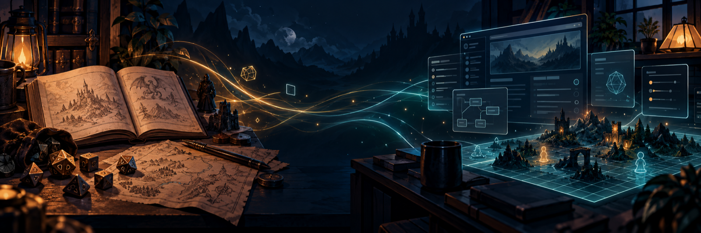

<h1 align="center">
  <picture>
    <source media="(prefers-color-scheme: dark)" srcset="brand/MR_11_Formal_Marfil_Transparente.png">
    
  </picture>
</h1>

  <strong>Diseño experiencias para Foundry VTT donde la tecnología intenta desaparecer detrás de la partida.</strong> 
  Sistemas completos, módulos, automatizaciones, localizaciones y herramientas narrativas para mesas virtuales.

  
  
  
  

---

## 🖼️ Proyectos destacados

<table>
  <tr>
    <td width="50%"><a href="https://github.com/ManuRomera/mr-un-momento-unico">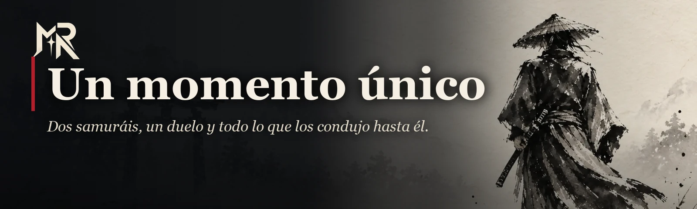</a></td>
    <td width="50%"><a href="https://github.com/ManuRomera/mr-cuentos-de-animas">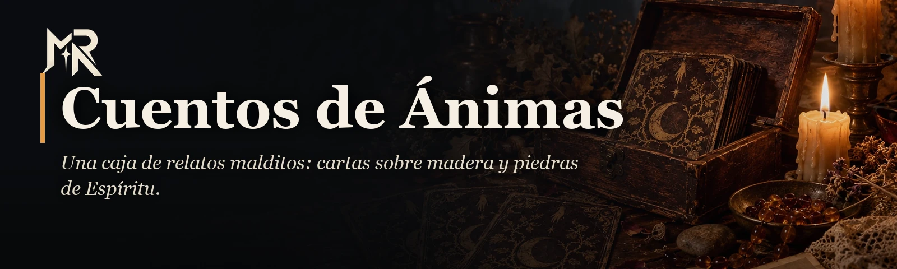</a></td>
  </tr>
  <tr>
    <td width="50%"><a href="https://github.com/ManuRomera/mr-bruja">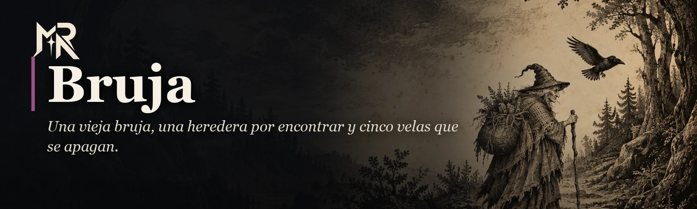</a></td>
    <td width="50%"><a href="https://github.com/ManuRomera/mr-nosotras-las-brujas">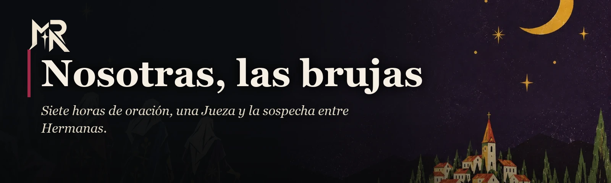</a></td>
  </tr>
  <tr>
    <td width="50%"><a href="https://github.com/ManuRomera/brindlewood-bay-foundry">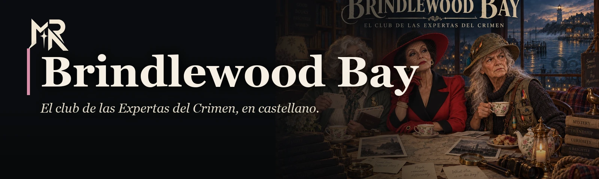</a></td>
    <td width="50%"><a href="https://github.com/ManuRomera/trueque-noir">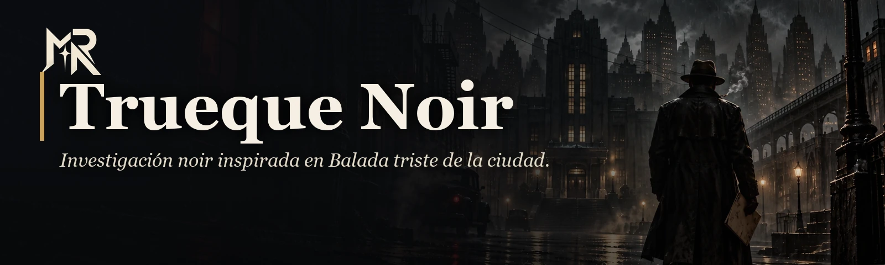</a></td>
  </tr>
  <tr>
    <td width="50%"><a href="https://github.com/ManuRomera/ocho-lanzas">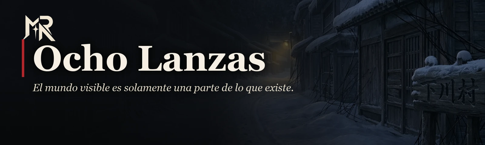</a></td>
    <td width="50%"><a href="https://github.com/ManuRomera/grimwild-es">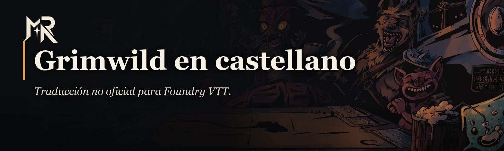</a></td>
  </tr>
  <tr>
    <td width="50%"><a href="https://github.com/ManuRomera/ruido-blanco">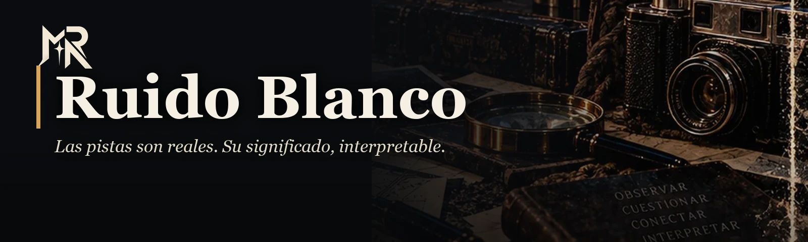</a></td>
    <td width="50%"><a href="https://github.com/ManuRomera/cuervos-de-asgard-mc">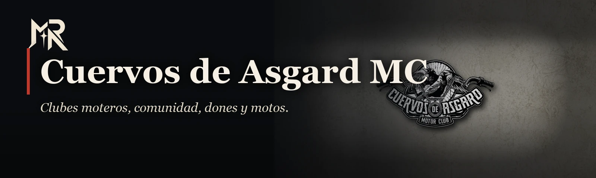</a></td>
  </tr>
  <tr>
    <td width="50%"><a href="https://github.com/ManuRomera/camc-persecuciones">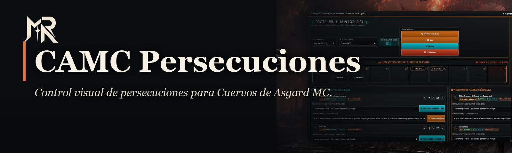</a></td>
    <td width="50%"><a href="https://github.com/ManuRomera/mr-entre-ruinas">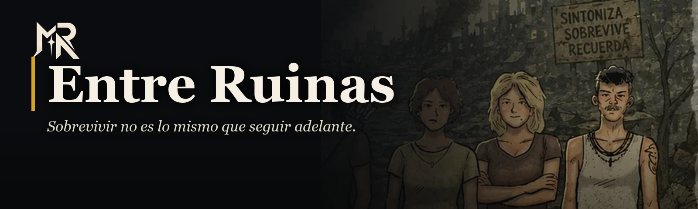</a></td>
  </tr>
  <tr>
    <td width="50%"><a href="https://github.com/ManuRomera/mr-story-night">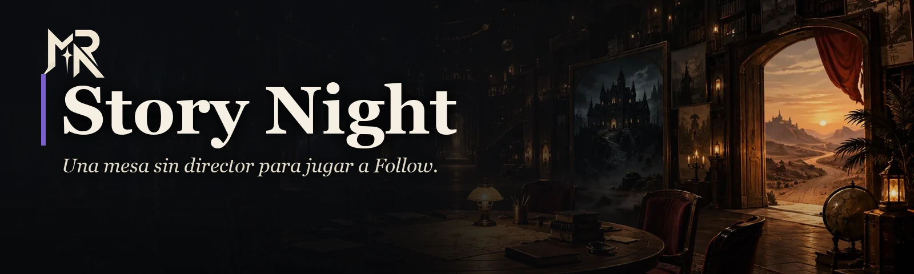</a></td>
    <td width="50%"><a href="https://github.com/ManuRomera/mr-telegram">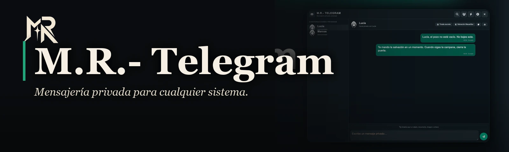</a></td>
  </tr>
  <tr>
    <td width="50%"><a href="https://github.com/ManuRomera/mr-token-stage">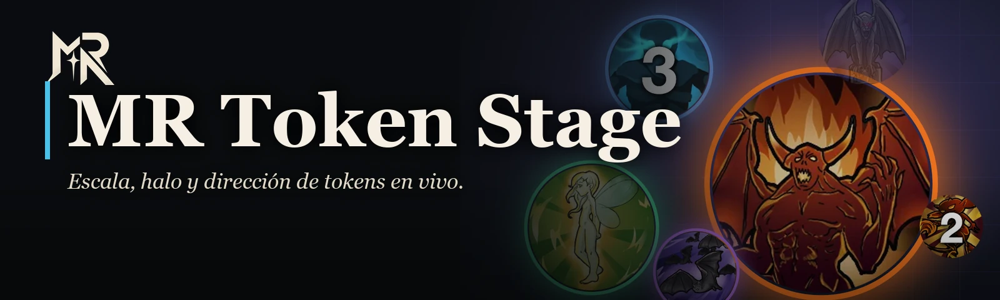</a></td>
    <td width="50%"><a href="https://github.com/ManuRomera/mr-standee-portrait">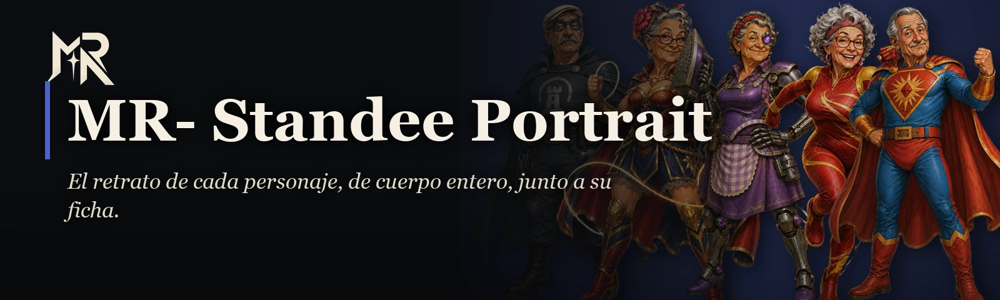</a></td>
  </tr>
  <tr>
    <td width="50%"><a href="https://github.com/ManuRomera/mr-chronicle">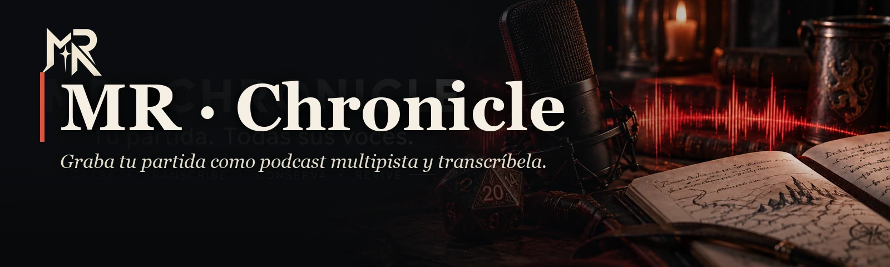</a></td>
    <td width="50%"><a href="https://github.com/ManuRomera/mr-la-ultima-emision">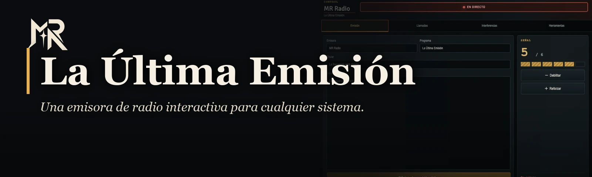</a></td>
  </tr>
  <tr>
    <td width="50%"><a href="https://github.com/ManuRomera/imserso-to-the-limit">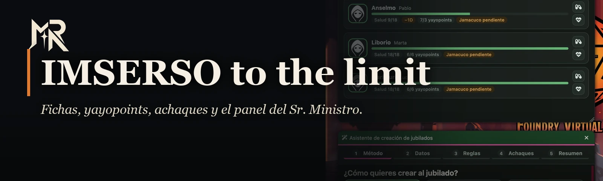</a></td>
    <td width="50%"><a href="https://github.com/ManuRomera/los-abuelos-de-la-justicia">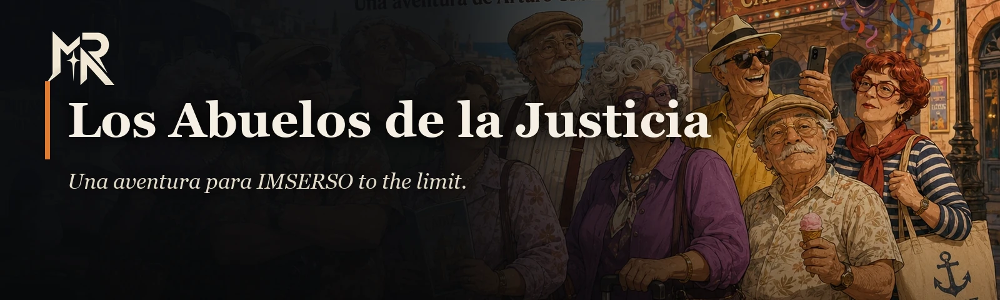</a></td>
  </tr>
  <tr>
    <td width="50%"><a href="https://github.com/ManuRomera/ysystem3-srd">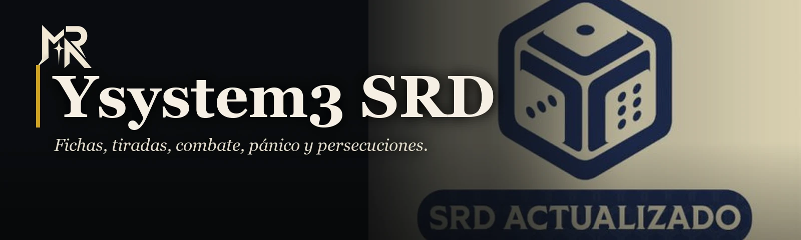</a></td>
    <td width="50%"><a href="https://github.com/ManuRomera/ol-attack">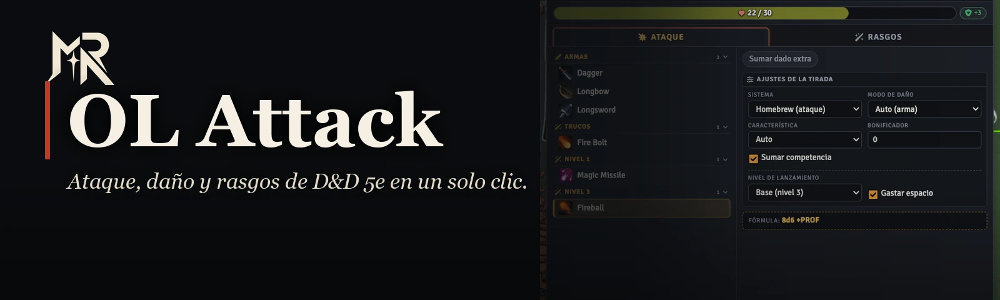</a></td>
  </tr>
  <tr>
    <td width="50%"><a href="https://github.com/ManuRomera/eterno-azul-foundry">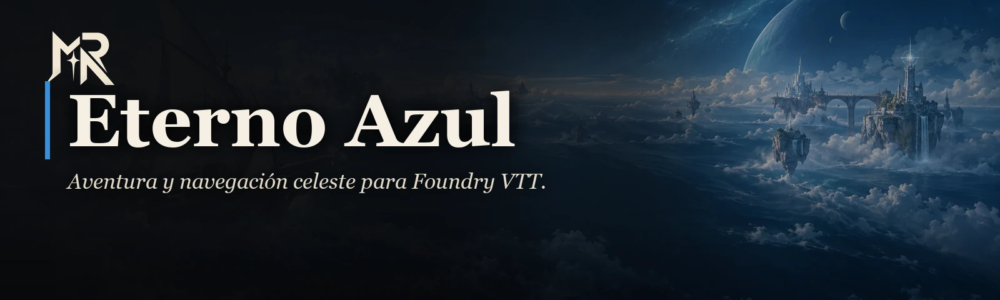</a></td>
    <td width="50%"><a href="https://github.com/ManuRomera/mausritter-damage-helper">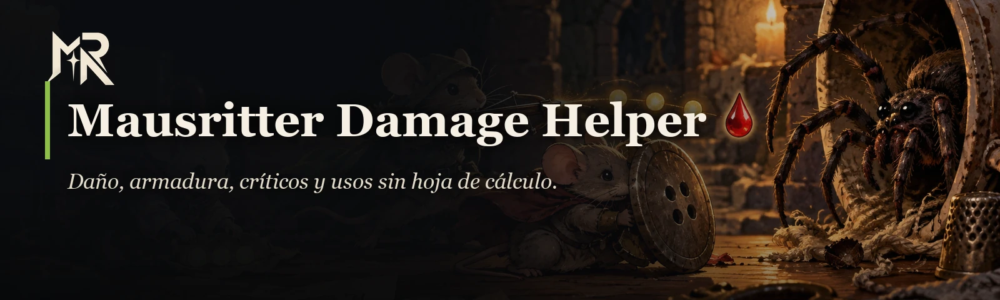</a></td>
  </tr>
  <tr>
    <td width="50%"><a href="https://github.com/ManuRomera/mausritter-wdip">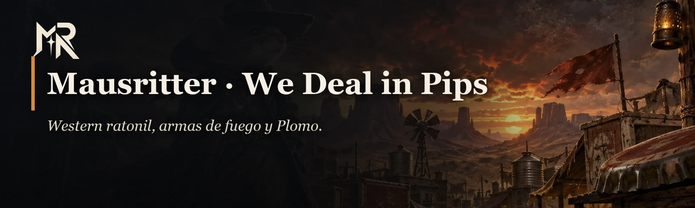</a></td>
    <td width="50%"><a href="https://github.com/ManuRomera/translation-spanish-daggerheart">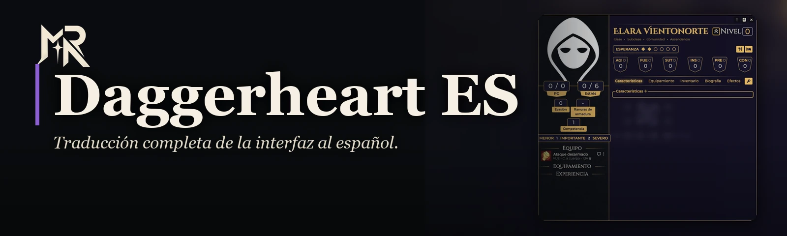</a></td>
  </tr>
  <tr>
    <td width="50%"></td>
    <td width="50%"><a href="https://github.com/ManuRomera/rp-accessibility">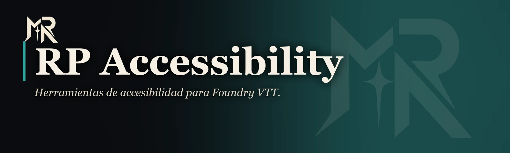</a></td>
  </tr>
  <tr>
    <td width="50%"><a href="https://github.com/ManuRomera/pbpe-exportador">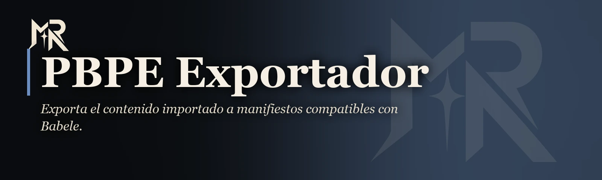</a></td>
    <td width="50%"></td>
  </tr>
  <tr>
    <td width="50%"></td>
    <td width="50%"></td>
  </tr>
</table>

Banners generados con una única plantilla: <code>scripts/make-banners.py</code> y <code>scripts/projects.json</code>.

---

## 🎭 La familia MR

Últimamente estoy llevando muchas de las ideas que nacen en mesa un paso más allá: no solo adaptar reglas, sino construir **experiencias completas alrededor de la partida**.

| Proyecto | Qué es |
| :--- | :--- |
| 🌌 **[MR · Story Night](https://github.com/ManuRomera/mr-story-night)** | Sistema sin director para jugar a **Follow** en Foundry. Compañía compartida, 24 misiones originales, edición simultánea, generadores, accesibilidad y una sala narrativa cuyo portal cambia con cada género. |
| 🎬 **[MR Token Stage](https://github.com/ManuRomera/mr-token-stage)** | Director visual de tokens para Foundry 13/14. Escala visual independiente, grupos, presets, foco, spotlight, encuadre, humanización y deshacer sin alterar la huella lógica del token. |
| 📻 **[MR · La Última Emisión](https://github.com/ManuRomera/mr-la-ultima-emision)** | Una emisora de radio interactiva y agnóstica de sistema. Locutor, oyentes, llamadas privadas, emisión pública sincronizada y overlay sobre la escena. **[Página del proyecto](https://manuromera.github.io/mr-la-ultima-emision/)** |
| ✉️ **[M.R. Telegram](https://github.com/ManuRomera/mr-telegram)** | Comunicación privada integrada en Foundry: mensajería, telegramas, cartas, terminales, adjuntos, tiradas secretas, estados de lectura y escritura concurrente real. |
| 🧱 **[MR · Entre Ruinas](https://github.com/ManuRomera/mr-entre-ruinas)** | Sistema para Foundry 13/14 del juego narrativo de MIDRA. Sin director fijo, Voz rotatoria, refugios, comunidades, crisis, oráculos y herramientas de campaña. |
| 🎙️ **[MR · Chronicle](https://github.com/ManuRomera/mr-chronicle)** | Graba tu partida de Foundry como pistas de audio por persona, con transcripción y recuerdos. Cada jugador graba en su navegador. |
| 🕯️ **[MR · Cuentos de Ánimas](https://github.com/ManuRomera/mr-cuentos-de-animas)** | Una caja de relatos malditos convertida en sistema para Foundry 13/14: cartas sobre madera, piedras de Espíritu y un modo íntimo 1 + 1. |
| ⚔️ **[MR · Un momento único](https://github.com/ManuRomera/mr-un-momento-unico)** | Duelo de samuráis para dos jugadores, sin Director: capítulos en *flashback*, siete marcadores, dados, odio y un Gran Final en cine mudo. La Mesa se integra a pantalla completa en la escena, con modo oscuro para quien tiene sensibilidad a la luz y corrección manual de lo que se consume solo. |
| 🌙 **[MR · Bruja](https://github.com/ManuRomera/mr-bruja)** | Una vieja bruja, una heredera por encontrar y cinco velas que se apagan. Para dos personas, con mesa, hojas y libro de identidad propia y una libreta cifrada. |
| 🔮 **[MR · Nosotras, las brujas](https://github.com/ManuRomera/mr-nosotras-las-brujas)** | Siete horas, una Jueza y las Hermanas: baraja de tarot generada, tracker «Ahora», escenas de fondo y mesa a pantalla completa. |

  <strong>MR no es una colección de botones: intento que cada herramienta tenga identidad, intención y una forma propia de integrarse en la ficción.</strong>

---

## 🔥 Sistemas que merece la pena abrir

### 🧓 IMSERSO to the limit
**[Repositorio →](https://github.com/ManuRomera/imserso-to-the-limit)**

Fichas, yayopoints, achaques, Jamacuco, peleas y el panel del Sr. Ministro. Sistema no oficial de YayoSystem, con la aventura *Los Abuelos de la Justicia* como módulo aparte.

### 🕵️ Trueque Noir · Balada Triste de la Ciudad
**[Repositorio →](https://github.com/ManuRomera/trueque-noir)**

Investigación noir con once ambientaciones visuales, construcción guiada de ciudad y detectives, mesa compartida del caso, archivo, ayudas contextuales y una interfaz pensada para jugar con ratón sin llenar la pantalla de ventanas.

### 🍰 Brindlewood Bay · El club de las Expertas del Crimen
**[Repositorio →](https://github.com/ManuRomera/brindlewood-bay-foundry)**

Sistema nativo en castellano con creación guiada de Expertas, seis misterios, tablero común del club, pistas, Teorizar, Coronas, generador de anuncios y una escena de salón que funciona como centro de campaña.

### ⚔️ Ocho Lanzas
**[Repositorio →](https://github.com/ManuRomera/ocho-lanzas)**

Un único sistema para Foundry 13 y 14, con la Maldición como núcleo visual y mecánico, fichas compactas, ayuda contextual, memoria de ventanas, tiradas integradas y la aventura *El Tejido de Yomi*.

### 🌑 Grimwild en castellano
**[Repositorio →](https://github.com/ManuRomera/grimwild-es)**

Localización profunda de Grimwild: interfaz, compendios, creación guiada, tiradas, monstruos, herramientas de DJ, tracker, ayudas contextuales, modo compacto y mejoras de accesibilidad.

### 📡 RUIDO BLANCO
**[Repositorio →](https://github.com/ManuRomera/ruido-blanco)**

Juego propio de investigación contemporánea emergente, con reglamento y sistema para Foundry VTT.

### 🐦‍⬛ Cuervos de Asgard MC
**[Repositorio →](https://github.com/ManuRomera/cuervos-de-asgard-mc)**

Sistema propio alrededor de clubes moteros, comunidad, dones, motos, generadores, automatizaciones y herramientas de campaña.

---

## 🐭 Mausritter, pero con más dientes

- **[Mausritter Damage Helper](https://github.com/ManuRomera/mausritter-damage-helper)** — aplica daño, armadura, HP/FUE, críticos y gasto de usos sin convertir Mausritter en una hoja de cálculo.
- **[Mausritter · We Deal in Pips](https://github.com/ManuRomera/mausritter-wdip)** — western ratonil, armas de fuego, Plomo, estética de cartel de recompensa y ayuda contextual integrada.

---

## 🧰 Más herramientas y sistemas

| Proyecto | Tipo |
| :--- | :--- |
| **[MR- Standee Portrait](https://github.com/ManuRomera/mr-standee-portrait)** | Presentación visual de personajes y tokens |
| **[RP Accessibility](https://github.com/ManuRomera/rp-accessibility)** | Herramientas de accesibilidad |
| **[CAMC Persecuciones](https://github.com/ManuRomera/camc-persecuciones)** | Herramientas para persecuciones |
| **[PBPE Exportador](https://github.com/ManuRomera/pbpe-exportador)** | Exportación y utilidades |
| **[YSYSTEM3 SRD](https://github.com/ManuRomera/ysystem3-srd)** | Sistema genérico para Foundry |
| **[Frontier Scum ES](https://github.com/ManuRomera/FrontierScum-ES-)** | Adaptación/localización para Foundry |
| **[Daggerheart en español](https://github.com/ManuRomera/translation-spanish-daggerheart)** | Localización de interfaz |
| **[Eterno Azul](https://github.com/ManuRomera/eterno-azul-foundry)** | Sistema / experiencia narrativa |
| **[Los Abuelos de la Justicia](https://github.com/ManuRomera/los-abuelos-de-la-justicia)** | Proyecto de campaña y personajes |
| **[OL Attack](https://github.com/ManuRomera/ol-attack)** | Ataque, daño y rasgos de D&D 5e en un solo clic |
| **[Queso Mentira](https://github.com/ManuRomera/foundryvtt-queso-mentira)** | Dado del Mentiroso pulp-militar |
| **[Sensa Fine](https://github.com/ManuRomera/Sensa_Fine)** | Aventura propia para Mosh con paquetizado de lujo |

---

## 🧭 Lo que intento repetir en todos mis proyectos

**Una sola herramienta para Foundry 13/14 cuando es viable.**  
**Ventanas que recuerdan dónde estaban y cuánto medían.**  
**Información bajo demanda con hover o clic derecho.**  
**Buen uso del espacio de pantalla.**  
**Accesibilidad, teclado, contraste y reducción de movimiento.**  
**Automatizar lo repetitivo sin automatizar las decisiones narrativas.**  
**Una identidad visual propia para cada juego.**

> **Menos software visible. Más partida.**

Gran parte de estos proyectos se desarrolla con apoyo de herramientas de IA para programación, diseño y revisión, siempre bajo mi dirección y revisión final.

  <a href="https://github.com/ManuRomera?tab=repositories"><strong>Explorar todos los repositorios →</strong></a>

